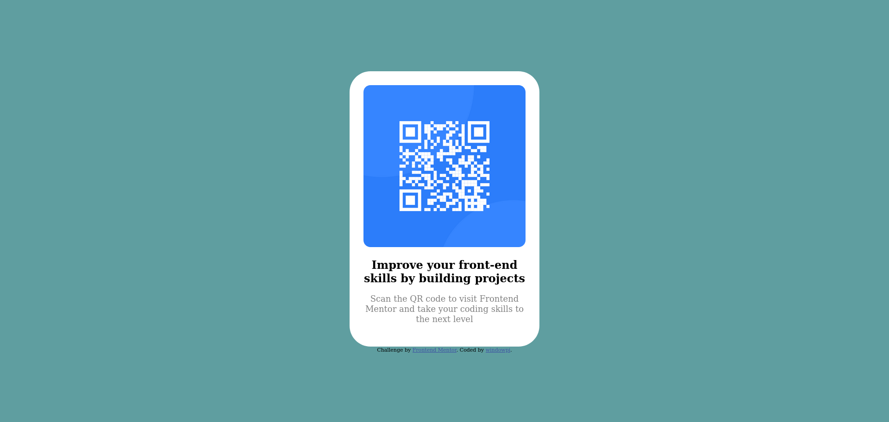
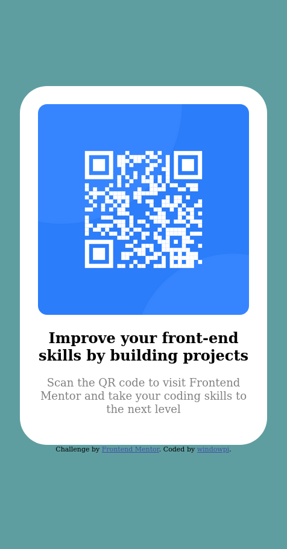

# Frontend Mentor - QR code component solution

This is a solution to the [QR code component challenge on Frontend Mentor](https://www.frontendmentor.io/challenges/qr-code-component-iux_sIO_H). Frontend Mentor challenges help you improve your coding skills by building realistic projects. 

## Table of contents

- [Overview](#overview)
  - [Screenshot](#screenshot)
  - [Links](#links)
- [My process](#my-process)
  - [Built with](#built-with)
  - [What I learned](#what-i-learned)
  - [Continued development](#continued-development)
  - [Useful resources](#useful-resources)
- [Author](#author)

## Overview

### Screenshot




### Links

- Solution URL: [github](https://github.com/windowpi/qr-code-component)
- Live Site URL: [github-pages](https://windowpi.github.io/qr-code-component/)

## My process

### Built with

- Semantic HTML5 markup
- CSS custom properties
- Flexbox

### What I learned

* Freshen up on how to style a page with basic css.
* How to change values with the @media css property


```css
@media screen and (max-width: 500px){
  body {
    margin-top: 30%;
  }
}
```

### Continued development

Would like to refine how I impliment margins and padding. Feel like I can do the same thing but with less code in my css for centering the container.

Also would like to learn how to center a component vertically without doing weird margin properties.

### Useful resources

- [MDN Web Docs](https://developer.mozilla.org/en-US/docs/Web/CSS/@media) - This helped me remember how to implement the @media property.

## Author

- Website - [windowpi](https://github.com/windowpi)
- Frontend Mentor - [@windowpi](https://www.frontendmentor.io/profile/windowpi)
